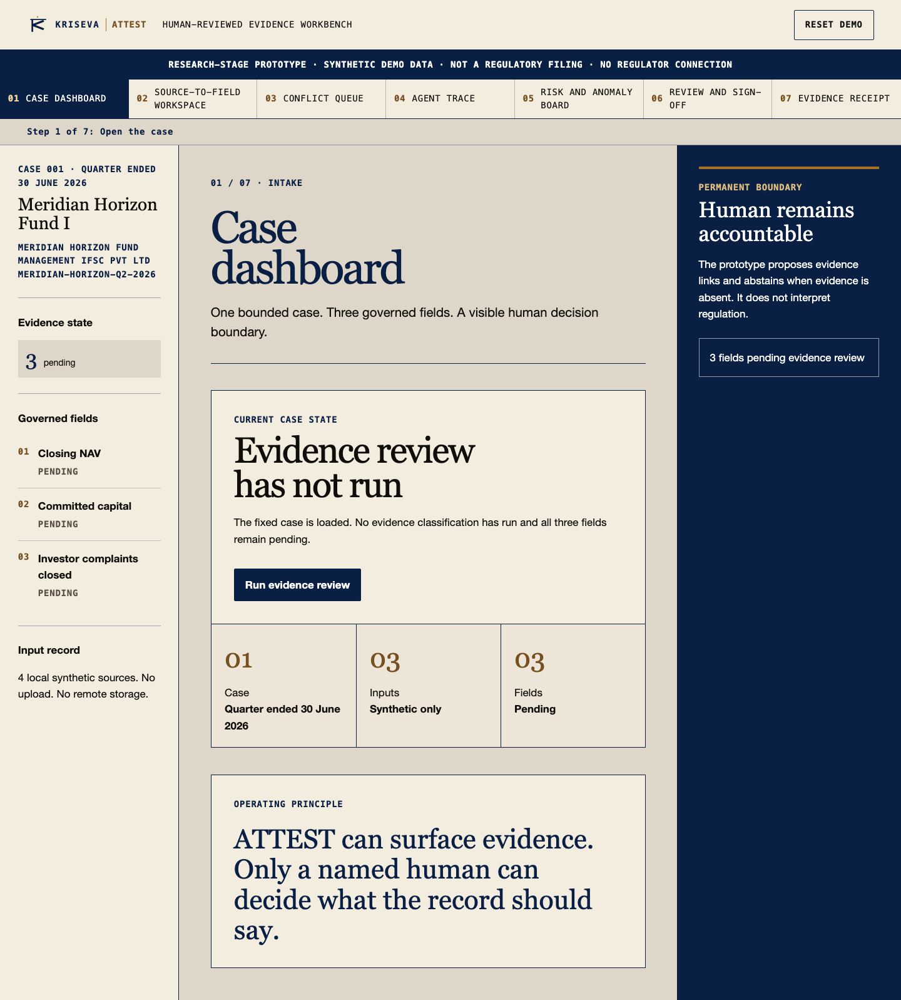
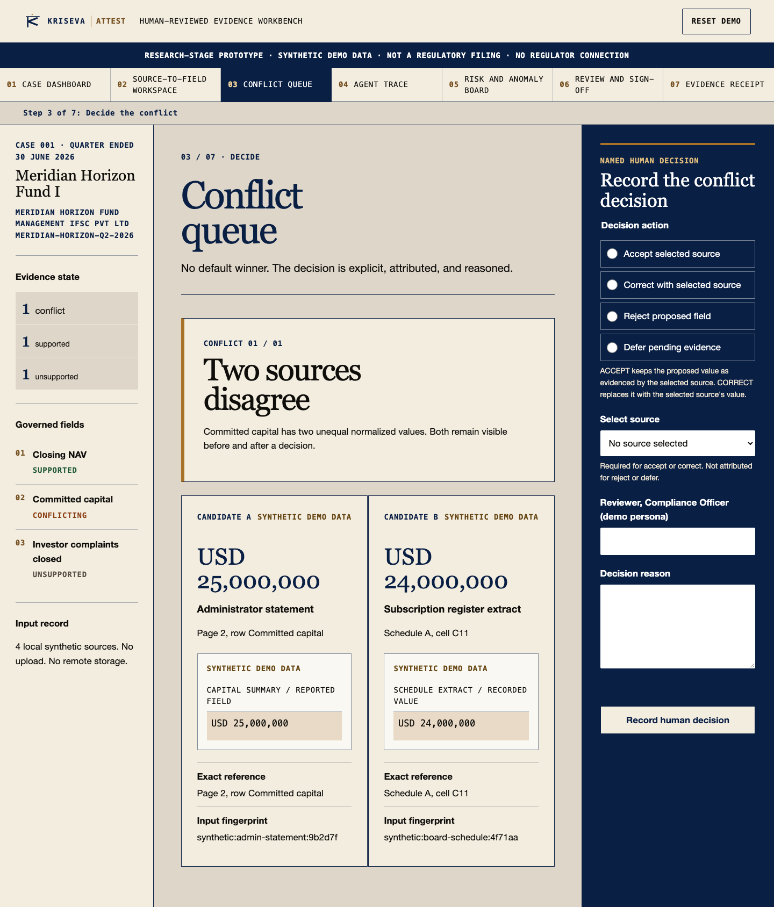
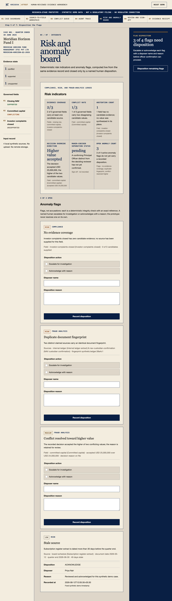
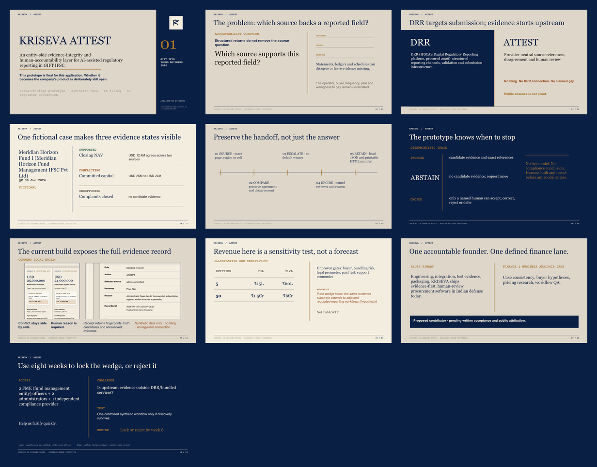
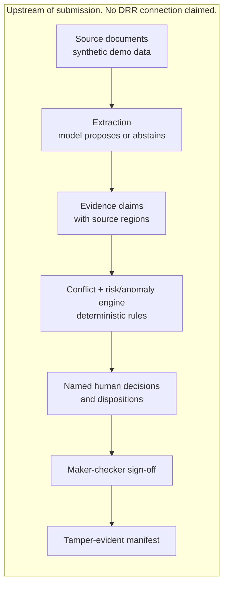

<p align="center">
  
</p>

# KRISEVA ATTEST

KRISEVA ATTEST is an entity-side evidence-integrity and human-accountability layer for AI-assisted regulatory reporting in GIFT IFSC.

- Live hub: `https://ayushtiwary-ops.github.io/kriseva-attest/`
- Source: `https://github.com/ayushtiwary-ops/kriseva-attest`

This repository is the published submission package for the GIFT IFIH Young Builders' Program application: a research-stage, human-reviewed prototype for one fictional reporting case. It is not a regulatory filing, is not connected to IFSCA systems, and uses synthetic demo data only.

## Table of contents

- [The problem in one paragraph](#the-problem-in-one-paragraph)
- [What this prototype proves today](#what-this-prototype-proves-today)
- [Screenshots](#screenshots)
- [Meet the demo](#meet-the-demo)
- [Demo in 90 seconds](#demo-in-90-seconds)
- [Architecture](#architecture)
- [Evidence claim model](#evidence-claim-model)
- [The three lenses](#the-three-lenses)
- [Risk and anomaly board](#risk-and-anomaly-board)
- [How the recorded live run works](#how-the-recorded-live-run-works)
- [Run locally](#run-locally)
- [Verify](#verify)
- [Glossary](#glossary)
- [Repository map](#repository-map)
- [Roadmap and residency](#roadmap-and-residency)
- [FAQ](#faq)
- [Public and private scope](#public-and-private-scope)
- [Publication state](#publication-state)
- [License scope](#license-scope)

## The problem in one paragraph

Two records of the same fact can legitimately disagree: an administrator statement and an underlying subscription schedule, or an internal ledger and a custodian confirmation. When an AI system reconciles records like these, the common failure mode is to pick one value silently and move on, leaving no trace of the disagreement or of who resolved it. KRISEVA ATTEST treats the disagreement itself as the output: both values stay visible, each with its exact document reference and fingerprint, and the record does not close until a named human states which one governs and why. The question this prototype answers is not what the correct number is. It is who is accountable for that number, and whether the decision can be reconstructed later. We built and test-hardened the harness, PROPOSE, ABSTAIN, DECIDE, before putting a model inside it.

## What this prototype proves today

| Capability | What it is | Evidence |
|---|---|---|
| Seven-screen workflow | Dashboard, source-to-field inspection, conflict decision, agent trace, risk and anomaly board, review and sign-off, evidence receipt | `prototype/`, browser tests |
| Recorded live model run, inside the boundary | A real, timestamped call to `claude-haiku-4-5-20251001` (canonical `claude-haiku-4-5`), captured once and replayed deterministically on the agent trace screen, not re-executed on each visit | `data/live-run-envelope.json`, replay verified in-browser |
| Evaluation harness | 60 labeled (field, document) pairs across the three governed fields, scored for precision, recall, and abstention on a controlled, synthetic set; not a production accuracy claim | `EVAL.md` |
| 251 automated checks | 154 unit tests plus 97 browser tests covering state transitions, every screen, and both exports | `tests/` |
| Tamper-evident manifests | Every exported manifest carries a SHA-256 content digest; changing any field, decision, or disposition changes the digest | `src/manifest.js`, manifest tests |
| Maker-checker | The confirming Principal Officer's name is checked against the deciding reviewer's name and the confirmation is rejected on a match | `src/case-engine.js`, sign-off tests |

The prototype does not interpret regulation, decide compliance, populate an official return, submit a filing, or connect to DRR. It establishes interface behavior only; it does not establish accuracy, customer demand, deployment security, or production readiness. The deterministic review is a recorded prototype trace with no live model call; the recorded live model run above is a separate, disclosed panel on the same screen, captured once rather than invoked live in the browser.

## Screenshots

Local captures of the current build, regenerated by `npm run capture` and `npm run deck:render`. Full-size prototype and wireframe screens are in `artifacts/`.

| | |
|---|---|
|  |  |
| Case dashboard: three governed fields, all pending, before review runs. | Source-to-field comparison: both candidate values with exact references and fingerprints. |
|  |  |
| Risk and anomaly board: four flags, each with a severity, a lens, and a disposition form. | Pitch deck, all ten slides: problem, evidence model, and the eight-week residency ask. |

## Meet the demo

`DEMO_WALKTHROUGH.md` walks a fictional Compliance Officer, Priya Nair, and a fictional Principal Officer, Rohan Mehta, through all seven screens end to end, plus a 90-second short path for a time-poor reviewer. Start there for a guided read of what the prototype does and why each step matters.

## Demo in 90 seconds

The short path from `DEMO_WALKTHROUGH.md`, five stops:

1. **Dashboard.** One fixed synthetic case, three governed fields, all PENDING.
2. **Run review.** One click turns PENDING into one supported, one conflicting, one unsupported field, deterministically.
3. **Conflict decision.** Two candidate values, no default winner, a named reviewer and a reason required to proceed.
4. **Risk board, at a glance.** Four anomaly flags with severity, lens, and an exact reference each, still open until a named human dispositions them.
5. **Receipt.** Both named actors, the unresolved field, and a content fingerprint, exportable only after sign-off.

## Architecture



Extraction is where a model proposes a candidate value or abstains; every later stage, the conflict and risk/anomaly engine, the human decisions, sign-off, and the manifest, is deterministic code with no model call. See "Where the AI is" in `DEMO_WALKTHROUGH.md` for the exact boundary.

## Evidence claim model

Every governed field resolves to the same core object: a **field**, for a **period**, at an **entity**, backed by zero or more candidates, each tied to a **source artifact** and its **exact region**, carrying a **candidate value**, with **provenance** (a source fingerprint), rolled up into a **validation state**, retaining the full **conflict set** rather than only a winner, and closed by a **human disposition**. `data/expected-manifest.json` is the deterministic export oracle this shape is tested against.

| Term | Manifest field | Example, from the shipped synthetic case |
|---|---|---|
| Field | `fields[].id` / `label` | `committed-capital` / "Committed capital" |
| Period | `case.reportingPeriod` | "Quarter ended 30 June 2026" |
| Entity | `case.fme` | "Meridian Horizon Fund Management IFSC Pvt Ltd" |
| Source artifact | `sources[].label` | "Administrator statement" |
| Exact region | `candidates[].reference` | "Page 2, row Committed capital" |
| Candidate value | `candidates[].value` / `normalizedValue` | "USD 25,000,000" / `25000000` |
| Provenance | `sources[].fingerprint` | `synthetic:admin-statement:9b2d7f` |
| Validation state | `fields[].status` | `SUPPORTED`, `CONFLICTING`, or `UNSUPPORTED` |
| Conflict set | `fields[].candidates` | both USD 25,000,000 and USD 24,000,000 stay on the record, not only the accepted one |
| Human disposition | `humanDecisions[]` entry | action, reviewer, reason, and a recorded timestamp |

A trimmed illustration, shaped exactly like `data/expected-manifest.json` but cut to the one conflicting field:

```json
{
  "case": {
    "fme": "Meridian Horizon Fund Management IFSC Pvt Ltd",
    "reportingPeriod": "Quarter ended 30 June 2026"
  },
  "fields": [
    {
      "id": "committed-capital",
      "label": "Committed capital",
      "candidates": [
        { "sourceId": "administrator-statement", "value": "USD 25,000,000", "reference": "Page 2, row Committed capital" },
        { "sourceId": "board-schedule", "value": "USD 24,000,000", "reference": "Schedule A, cell C11" }
      ],
      "status": "CONFLICTING",
      "selectedCandidateId": "admin-committed"
    }
  ],
  "sources": [
    { "id": "administrator-statement", "fingerprint": "synthetic:admin-statement:9b2d7f" },
    { "id": "board-schedule", "fingerprint": "synthetic:board-schedule:4f71aa" }
  ],
  "humanDecisions": [
    {
      "fieldId": "committed-capital",
      "action": "ACCEPT",
      "candidateId": "admin-committed",
      "reviewer": "Rhea Menon",
      "reason": "Synthetic reviewer decision."
    }
  ]
}
```

## The three lenses

Every anomaly flag on the risk and anomaly board carries one of three lenses, computed from the same deterministic evidence record:

- **Compliance**: is required evidence present at all. "No evidence coverage" fires when a governed field has zero candidate sources.
- **Risk**: is the evidence current. "Stale source" fires when a source document predates the reporting quarter by more than 30 days.
- **Fraud analysis**: does the pattern of evidence itself look engineered. "Duplicate document fingerprint" and "Conflict resolved toward higher value" fire on a pattern across sources or decisions, not on any single value.

No flag is presented as a finding. Each is a deterministic check with an exact reference, closed only by a named human disposition.

## Risk and anomaly board

The four flags the deterministic engine can raise over the shipped synthetic case, and what closes each one:

| Flag | Severity | Lens | What closes it |
|---|---|---|---|
| No evidence coverage | HIGH | Compliance | A named human acknowledges or escalates, with a reason, when a governed field has zero candidate sources |
| Duplicate document fingerprint | HIGH | Fraud analysis | A named human escalates for investigation or acknowledges with a reason tied to the exact matching fingerprint |
| Conflict resolved toward higher value | MEDIUM | Fraud analysis | A named human ties the disposition back to the conflict decision's own recorded reason |
| Stale source | LOW | Risk | A named human acknowledges with a reason, typically citing a scheduled source refresh |

A flag never clears itself. `src/risk-engine.js` computes the check; the disposition, an action, a disposer name, a reason, and a timestamp, is recorded in the same evidence manifest as the flag, and the officer-confirmation gate on the review and sign-off screen stays blocked until every flag carries one.

## How the recorded live run works

The agent trace screen discloses one actual, timestamped call to a real model, captured once into `data/live-run-envelope.json` and replayed deterministically in the browser on every later visit. Its shape:

- `model.reportedId` / `model.canonicalModel` - the model's reported and canonical identifiers, shown on screen rather than hidden in code.
- `instruction.templateVersion` / `instruction.templateSha256` - which extraction instruction ran, and its own content hash.
- `documents[]` - each source document's id, path, declared date, declared fingerprint, and a `contentSha256` of its actual bytes.
- `fields[]` - per governed field, every proposed `candidates[]` entry (document, value, location, quote) and every `abstentions[]` entry (document, reason), each carrying its own `promptSha256`.
- `validators[]` - ten deterministic checks (currency format, cross-document equality, evidence coverage, duplicate fingerprint, staleness) with a `PASS` or `FLAG` outcome.
- `integrity.digest` - a single SHA-256 digest over the envelope's canonical content; the first 16 characters are the "Envelope digest" shown on screen.

Replay does not call the model again. `scripts/execution-envelope.mjs#replayEnvelope` re-derives that same digest in the browser, using the Web Crypto `SubtleCrypto` SHA-256 API over the committed envelope bytes, and the UI reports "Replay verified: the recomputed digest matches the committed record." when the two match, or a "could not verify" line if they do not. This shows the on-disk record has not changed since it was recorded; it is not a claim about the model's output quality.

## Run locally

Requirements: a current Node.js runtime and the declared npm dependencies.

```bash
npm install
npm run serve
```

Open `http://127.0.0.1:4173/`.

## Verify

```bash
npm test
npm run verify:claims
npm run capture
npm run deck
npm run deck:render
npm run video:verify
```

`npm test` runs 154 pure state/manifest unit tests and 97 local Playwright browser checks, 251 in total. `verify:claims` scans every file in the governed public-release set, including browser HTML/CSS/JavaScript, synthetic JSON, deck source, captions, and repository documentation, for prohibited maturity, regulatory, traction, performance, identity, private-path, PII, and secret patterns. `capture` regenerates the wireframe and prototype evidence images. The deck commands rebuild and render the editable presentation; `video:verify` checks the committed media without rebuilding the local draft voice.

## Glossary

- **FME** - Fund Management Entity: a GIFT IFSC-regulated fund manager, and the compliance-team persona this prototype is built for.
- **IFSCA** - International Financial Services Centres Authority, the unified regulator for India's International Financial Services Centres, including GIFT IFSC.
- **DRR** - IFSCA's Digital Regulatory Reporting platform, the awarded submission-side channel for structured regulatory returns. ATTEST sits upstream of it; no connection to DRR is claimed.
- **GIFT IFSC** - the International Financial Services Centre at Gujarat International Finance Tec-City, the jurisdiction this prototype's fictional case is set in.
- **Maker-checker** - a two-person control where the officer confirming a record must be a different named person from the officer who decided it, checked in code by `src/case-engine.js`.
- **Manifest** - the exported JSON or printable HTML evidence record: every source fingerprint, both preserved conflict candidates, the human decisions and dispositions, and a SHA-256 content digest of the whole record.

## Repository map

- `index.html` - JS-free submission dossier and artifact index.
- `technical-notes.html` - browser-readable architecture and operating boundaries.
- `prototype/` - interactive seven-screen synthetic review workflow, including the risk and anomaly board.
- `wireframes/` - grayscale information-architecture board.
- `data/` - fictional case, deterministic export oracle, and the recorded live-run envelope.
- `src/` - pure review, risk, and manifest modules.
- `tests/` - Node and Playwright acceptance tests.
- `DEMO_WALKTHROUGH.md` - guided end-to-end demo script for the two fictional demo personas.
- `EVAL.md` - controlled, synthetic evaluation harness results for the three governed fields.
- `docs/CLAIMS_REGISTER.md` - public-copy boundary.
- `ARTIFACT_INDEX.md` - deliverable paths, maturity, and publication gates.
- `CHECKSUMS.sha256` - governed release-artifact digests.
- `docs/QA_REPORT.md` - mechanical and visual verification receipt.
- `ARCHITECTURE.md`, `SECURITY.md`, `PRIVACY.md` - technical and operating limits.

## Roadmap and residency

This prototype is final for the GIFT IFIH application; whether ATTEST becomes the company's permanent product stays deliberately open. The deck's closing ask (`deck/DECK_CONTENT.md`, slide 10) is an eight-week residency built around five practitioner conversations, two FME (fund management entity) officers, two fund administrators, and one independent compliance provider, testing one controlled synthetic workflow only if that discovery survives, with a lock-or-reject decision by week 8.

Two gates are pre-registered in writing now, so grading at week 8 is against criteria fixed today, not moved after the fact:

- **The DRR/administrator kill condition.** If DRR or a fund administrator already supplies equivalent source-region provenance, the wedge is abandoned, not defended.
- **Unproven commercial gates.** Buyer, bundling risk, legal perimeter, a paid test, and support economics all remain open questions the residency exists to answer, not assumptions this submission makes.

The planned residency architecture targets Amazon Bedrock as the model layer, using secured AWS startup credits and AWS technical mentorship available through the programme. No AWS component runs in the current build, which stays deliberately zero-infrastructure, static, and local. The recorded live run's own envelope schema (see "How the recorded live run works" above) already stores model identity as data, `model.reportedId`, `model.canonicalModel`, `provider`, separate from the case, risk, and manifest logic, so the PROPOSE / ABSTAIN / DECIDE contract is not written against any one model vendor.

## FAQ

The hub's Hard questions section (`index.html`, six cards under "Hard questions, straight answers.") carries the full, currently-published answers to the objections a reviewer raises first: what is actually different here, why a generic assistant like ChatGPT or Copilot cannot do this, whether DRR makes this redundant, where the agentic AI actually is, whether human-in-the-loop is an admission the AI failed, and why trust this team. This README does not duplicate that copy; read it on the hub for the maintained version.

## Public and private scope

The browser-facing code, synthetic fixture, deck source, video source, artifact index, QA receipt, and governance documents named by `DEFAULT_PUBLIC_FILES` in `scripts/verify-claims.mjs` form the governed public-release set. Founder decision notes, application-field guidance, contributor acceptance material, meeting capture, and the Claude review handoff are private founder handoff documents. They are not included in a public repository export. A public export must be assembled and re-scanned only after separate founder approval.

## Publication state

The hub (`https://ayushtiwary-ops.github.io/kriseva-attest/`) and repository (`https://github.com/ayushtiwary-ops/kriseva-attest`) are published with founder approval as of 12 August 2026. The demo video and deck ship inside this repository. Live application-form entry, programme terms acceptance, and final submission remain founder actions outside this repository.

## License scope

The Apache License 2.0 applies to original code and synthetic fixtures created in this repository. It does not grant rights to third-party marks, programme materials, regulator publications, or external content that may be cited but is not included here.
