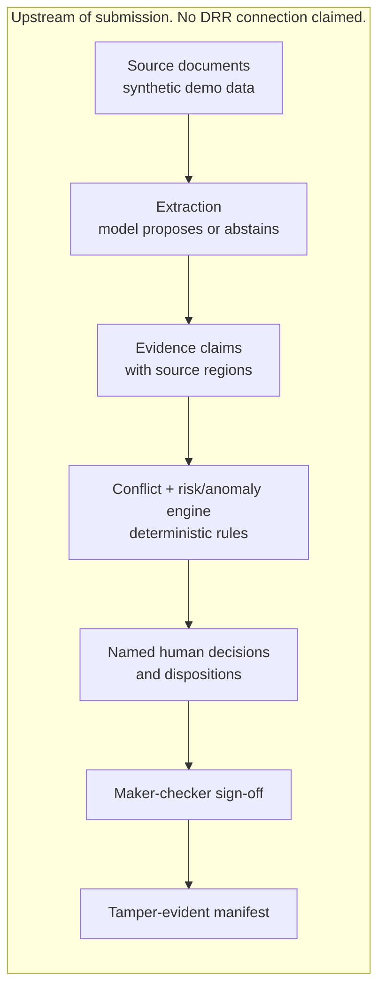

# KRISEVA ATTEST

KRISEVA ATTEST is an entity-side evidence-integrity and human-accountability layer for AI-assisted regulatory reporting in GIFT IFSC.

- Live hub: `https://ayushtiwary-ops.github.io/kriseva-attest/`
- Source: `https://github.com/ayushtiwary-ops/kriseva-attest`

This repository is the published submission package for the GIFT IFIH Young Builders' Program application: a research-stage, human-reviewed prototype for one fictional reporting case. It is not a regulatory filing, is not connected to IFSCA systems, and uses synthetic demo data only.

## The problem in one paragraph

Two records of the same fact can legitimately disagree: an administrator statement and an underlying subscription schedule, or an internal ledger and a custodian confirmation. When an AI system reconciles records like these, the common failure mode is to pick one value silently and move on, leaving no trace of the disagreement or of who resolved it. KRISEVA ATTEST treats the disagreement itself as the output: both values stay visible, each with its exact document reference and fingerprint, and the record does not close until a named human states which one governs and why. The question this prototype answers is not what the correct number is. It is who is accountable for that number, and whether the decision can be reconstructed later. We built and test-hardened the harness, PROPOSE, ABSTAIN, DECIDE, before putting a model inside it.

## What this prototype proves today

| Capability | What it is | Evidence |
|---|---|---|
| Seven-screen workflow | Dashboard, source-to-field inspection, conflict decision, agent trace, risk and anomaly board, review and sign-off, evidence receipt | `prototype/`, browser tests |
| Recorded live model run, inside the boundary | A real, timestamped call to `claude-haiku-4-5-20251001` (canonical `claude-haiku-4-5`), captured once and replayed deterministically on the agent trace screen, not re-executed on each visit | `data/live-run-envelope.json`, replay verified in-browser |
| Evaluation harness | 60 labeled (field, document) pairs across the three governed fields, scored for precision, recall, and abstention on a controlled, synthetic set; not a production accuracy claim | `EVAL.md` |
| 251 automated checks | 154 unit tests plus 97 browser tests covering state transitions, every screen, and both exports | `tests/` |
| Tamper-evident manifests | Every exported manifest carries a SHA-256 content digest; changing any field, decision, or disposition changes the digest | `src/manifest.js`, manifest tests |
| Maker-checker | The confirming Principal Officer's name is checked against the deciding reviewer's name and the confirmation is rejected on a match | `src/case-engine.js`, sign-off tests |

The prototype does not interpret regulation, decide compliance, populate an official return, submit a filing, or connect to DRR. It establishes interface behavior only; it does not establish accuracy, customer demand, deployment security, or production readiness. The deterministic review is a recorded prototype trace with no live model call; the recorded live model run above is a separate, disclosed panel on the same screen, captured once rather than invoked live in the browser.

## Meet the demo

`DEMO_WALKTHROUGH.md` walks a fictional Compliance Officer, Priya Nair, and a fictional Principal Officer, Rohan Mehta, through all seven screens end to end, plus a 90-second short path for a time-poor reviewer. Start there for a guided read of what the prototype does and why each step matters.

## Architecture



Extraction is where a model proposes a candidate value or abstains; every later stage, the conflict and risk/anomaly engine, the human decisions, sign-off, and the manifest, is deterministic code with no model call. See "Where the AI is" in `DEMO_WALKTHROUGH.md` for the exact boundary.

## The three lenses

Every anomaly flag on the risk and anomaly board carries one of three lenses, computed from the same deterministic evidence record:

- **Compliance**: is required evidence present at all. "No evidence coverage" fires when a governed field has zero candidate sources.
- **Risk**: is the evidence current. "Stale source" fires when a source document predates the reporting quarter by more than 30 days.
- **Fraud analysis**: does the pattern of evidence itself look engineered. "Duplicate document fingerprint" and "Conflict resolved toward higher value" fire on a pattern across sources or decisions, not on any single value.

No flag is presented as a finding. Each is a deterministic check with an exact reference, closed only by a named human disposition.

## Run locally

Requirements: a current Node.js runtime and the declared npm dependencies.

```bash
npm install
npm run serve
```

Open `http://127.0.0.1:4173/`.

## Verify

```bash
npm test
npm run verify:claims
npm run capture
npm run deck
npm run deck:render
npm run video:verify
```

`npm test` runs 154 pure state/manifest unit tests and 97 local Playwright browser checks, 251 in total. `verify:claims` scans every file in the governed public-release set, including browser HTML/CSS/JavaScript, synthetic JSON, deck source, captions, and repository documentation, for prohibited maturity, regulatory, traction, performance, identity, private-path, PII, and secret patterns. `capture` regenerates the wireframe and prototype evidence images. The deck commands rebuild and render the editable presentation; `video:verify` checks the committed media without rebuilding the local draft voice.

## Repository map

- `index.html` - JS-free submission dossier and artifact index.
- `technical-notes.html` - browser-readable architecture and operating boundaries.
- `prototype/` - interactive seven-screen synthetic review workflow, including the risk and anomaly board.
- `wireframes/` - grayscale information-architecture board.
- `data/` - fictional case, deterministic export oracle, and the recorded live-run envelope.
- `src/` - pure review, risk, and manifest modules.
- `tests/` - Node and Playwright acceptance tests.
- `DEMO_WALKTHROUGH.md` - guided end-to-end demo script for the two fictional demo personas.
- `EVAL.md` - controlled, synthetic evaluation harness results for the three governed fields.
- `docs/CLAIMS_REGISTER.md` - public-copy boundary.
- `ARTIFACT_INDEX.md` - deliverable paths, maturity, and publication gates.
- `CHECKSUMS.sha256` - governed release-artifact digests.
- `docs/QA_REPORT.md` - mechanical and visual verification receipt.
- `ARCHITECTURE.md`, `SECURITY.md`, `PRIVACY.md` - technical and operating limits.

## Public and private scope

The browser-facing code, synthetic fixture, deck source, video source, artifact index, QA receipt, and governance documents named by `DEFAULT_PUBLIC_FILES` in `scripts/verify-claims.mjs` form the governed public-release set. Founder decision notes, application-field guidance, contributor acceptance material, meeting capture, and the Claude review handoff are private founder handoff documents. They are not included in a public repository export. A public export must be assembled and re-scanned only after separate founder approval.

## Publication state

The hub (`https://ayushtiwary-ops.github.io/kriseva-attest/`) and repository (`https://github.com/ayushtiwary-ops/kriseva-attest`) are published with founder approval as of 12 August 2026. The demo video and deck ship inside this repository. Live application-form entry, programme terms acceptance, and final submission remain founder actions outside this repository.

## License scope

The Apache License 2.0 applies to original code and synthetic fixtures created in this repository. It does not grant rights to third-party marks, programme materials, regulator publications, or external content that may be cited but is not included here.
